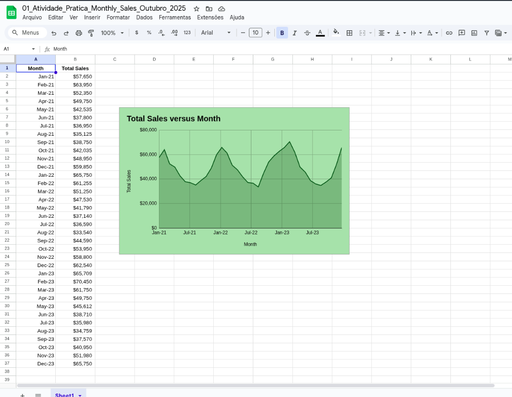

# Atividade prática: Gerar um gráfico a partir de uma Planilha

## Cenário
O cenário: Analisar padrões nas vendas mensais

Para ajudar a determinar o estoque e os níveis de pessoal ideais, sua empresa pediu que você analisasse as tendências de vendas totais dos últimos três anos. Como sua empresa depende de turistas para a maior parte de suas vendas, os líderes sabem que a demanda por estoque e os Requisitos de pessoal variam de acordo com a Sazonalidade turística. Eles pediram que você identificasse os meses de pico para ajudar na Previsão de Requisitos para o próximo ano. Para isso, você criará um Gráfico. 

## Pergunta
- Como o Gráfico de linha o ajuda a visualizar os dados de vendas?  

- Baseado em sua análise, quando sua empresa precisará aumentar a equipe e o estoque?

## Minha Resposta
O gráfico de linha nos permite ter uma visualização real dos dados. Ao invés de fazer apenas a leitura da planilha (o que pode chegar a ser confuso para algumas pessoas ou até mesmo cansativo), o gráfico de linha permite a gente enxergar pontos especícios de forma intuitiva e claro. 

Baseado na minha análise, a empresa precisará aumentar a equipe e o estoque entre os meses de Setembro a Novembro, pois é o período anterior ao período onde há maiores índices de vendas. Sendo necessário planejamento e organização para lidar com muitas vendas.

