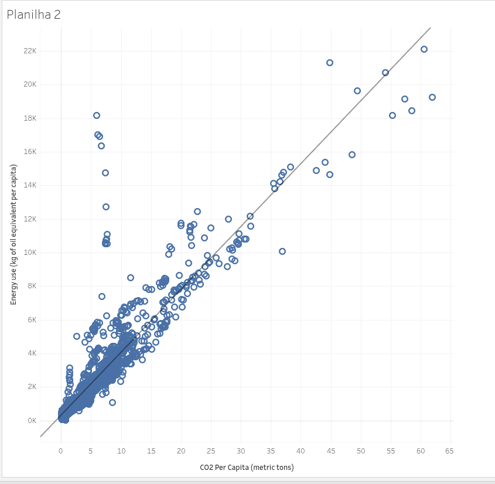
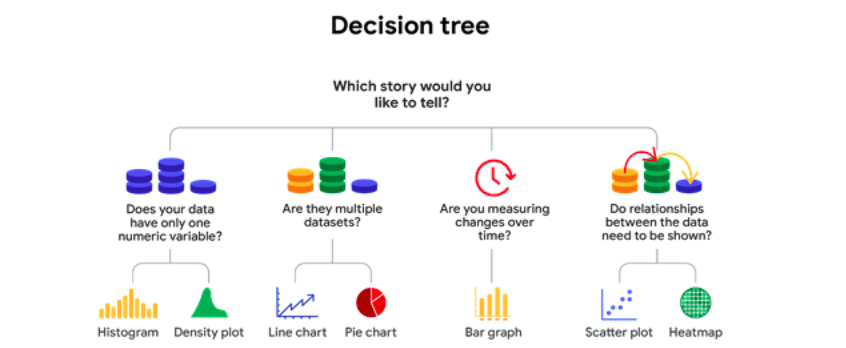

# Autorreflexão: Escolha seu tipo de Visualização

## Visão geral da atividade

Agora que você foi apresentado às árvores de decisão, pare por um momento e pratique o que está aprendendo. Nesta autorreflexão, você primeiro analisará as árvores de decisão e as práticas recomendadas de Visualização de dados. Em seguida, examinará um cenário, usará uma árvore de decisão para determinar o tipo de gráfico mais eficaz com base no cenário e responderá a breves perguntas. 

Essa autorreflexão o ajudará a desenvolver insights sobre seu próprio aprendizado e o preparará para usar uma Árvore de decisão para ajudá-lo a planejar sua próxima Visualização. Ao responder às perguntas - e fazer suas próprias perguntas -, você considerará conceitos, práticas e princípios para ajudar a refinar sua compreensão e reforçar sua Aprendizagem. Responder e fazer perguntas nessa autorreflexão ajudará a reforçar o que você aprendeu até agora, de modo que será mais fácil lembrar-se disso mais tarde.

---

## Cenário

---

## Reflexão

- Em seu próximo projeto, considere as vendas do Produto A em todo o país. As vendas variam consideravelmente de acordo com a cidade do país, e a equipe executiva está interessada em segmentação por interesse em publicidade por região. Use a Árvore de decisão para determinar qual tipo de gráfico é a melhor opção para esse projeto. 

**Como a Árvore de decisão simplificou seu processamento de decisão?**

**O resultado da árvore de decisão foi diferente de seu primeiro instinto?**

**A Árvore de decisão apresentada nesta atividade pode ser usada para determinar o tipo de gráfico com base no tipo de dados e no tipo de história que você deseja contar. Como você modificaria a Árvore de decisão para ajudá-lo a escolher um tipo de gráfico com base no seu público?**

---

## Minha Resposta

A Árvore de Decisão ajuda o analista de dados a estruturar seu pensamento analítico e matemático. Ela consiste em pegar um problema maior e dividi-lo em partes menores, a fim de, passo a passo, determinar quais pequenas ações, em conjunto, resolverão o problema principal. Basicamente, esse é o seu propósito.Ou seja, ao compreender o cenário do projeto proposto, fui respondendo, passo a passo, a perguntas-chave com “sim” ou “não”, o que me ajudou a definir qual tipo de visualização representaria melhor a história que eu queria contar. Dessa forma, o processo de tomada de decisão tornou-se mais simples e estruturado.

O resultado da árvore de decisão não foi diferente do meu primeiro instinto. Logo percebi que o projeto proposto enfoca a relação entre duas variáveis (vendas e cidade do país), o que responde à seguinte pergunta-chave da árvore de decisão: as relações entre os dados precisam ser mostradas? Sim: Mapa de Calor.

Eu perguntaria, na árvore de decisão, quais são os tipos de dados com os quais eu iria trabalhar: se são dados numéricos, dados de texto, datas ou valores booleanos. Acredito, no meu pensamento de analista em formação, que estudar os dados a serem explorados e apresentados também é fundamental para a escolha da visualização com a qual quero contar a história para as partes interessadas.

Tenho um exemplo: antes de perguntar se os dados têm apenas uma variável numérica, eu perguntaria se eles consistem em variáveis do tipo texto, numérica, booleana, data etc. Se forem numéricos, verificaria se há apenas uma variável ou não. Se sim, poderia utilizar um histograma ou um gráfico de densidade; se não, seguiria com outras perguntas envolvendo os demais tipos de dados.

Sobre esses detalhes e o nível de influência que os tipos de dados exercem nas visualizações, ainda estou aprendendo. No entanto, meu instinto diz que isso é fundamental.