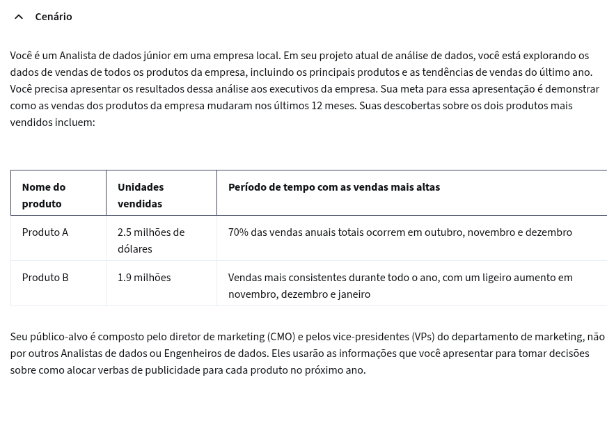
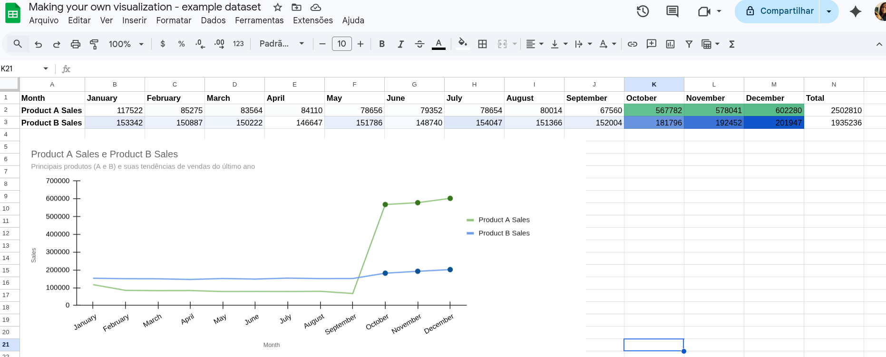

# Atividade prática: Crie sua própria visualização

## Visão geral da atividade

No início deste curso, você aprendeu a importância da visualização de dados com o design thinking. Nesta atividade, você aplicará esse conhecimento e criará sua própria visualização a partir de um conjunto de dados.

Ao concluir esta atividade, você será capaz de criar e personalizar Visualizações de dados usando o Editor de gráficos em uma Planilha. Isso lhe permitirá responder a uma pergunta comercial com uma representação compartilhável dos dados, o que é importante para apresentar suas descobertas em sua carreira como Analista de dados.

---

## Cenário

---

## Gráfico que realizei

---

## Reflexão

**Que insights você obteve sobre os dois produtos que visualizou? Que tendências você observou?**

**Como o design thinking (empatia, definição, ideação, protótipo, teste) influenciou o processamento da visualização de dados?**

**Como o design thinking pode ajudar a tornas as visualizações de dados mais acessíveis e fáceis de entender?**

---

## Minha Resposta
O Produto A apresentou pequenas variações em suas vendas ao longo do ano, mas registrou um crescimento expressivo nos meses de outubro, novembro e dezembro.

O Produto B, por sua vez, manteve relativa estabilidade durante o ano e, a partir de outubro, novembro e dezembro, passou a apresentar um crescimento pequeno, porém notável.

Para ambos os produtos, as tendências de alta foram identificadas nos últimos meses do ano, possivelmente em razão das festividades de fim de ano, o que pode indicar um período de alta temporada. No entanto, para confirmar essa hipótese, seria necessária a análise combinada de mais dados.

Além disso, o Produto A apresentou um crescimento mais acentuado em comparação ao Produto B. Ainda assim, pode-se considerar que o Produto B deva receber maior investimento em publicidade, a fim de potencializar seu desempenho.

O Design Thinking me levou a desenvolver uma visualização centrada nas partes interessadas. A visualização deve ser clara e concisa, enfatizar os pontos relevantes para o negócio, reduzir a ênfase em informações que não sejam necessárias ao contexto e utilizar o contraste de cores de forma estratégica para representar os dados. Essas foram algumas das atitudes adotadas para que o usuário, ao acessar os dados, tenha suas necessidades evidenciadas e seja estimulado à tomada de decisão.

O Design Thinking é extremamente essencial, pois mantém o foco nas necessidades do usuário. Quando a visualização de dados é construída com essa perspectiva, ela se torna mais eficaz para a compreensão das informações e para a tomada de decisão, alinhando-se ao que a parte interessada necessita em determinado momento e tornando a comunicação mais clara e acessível.