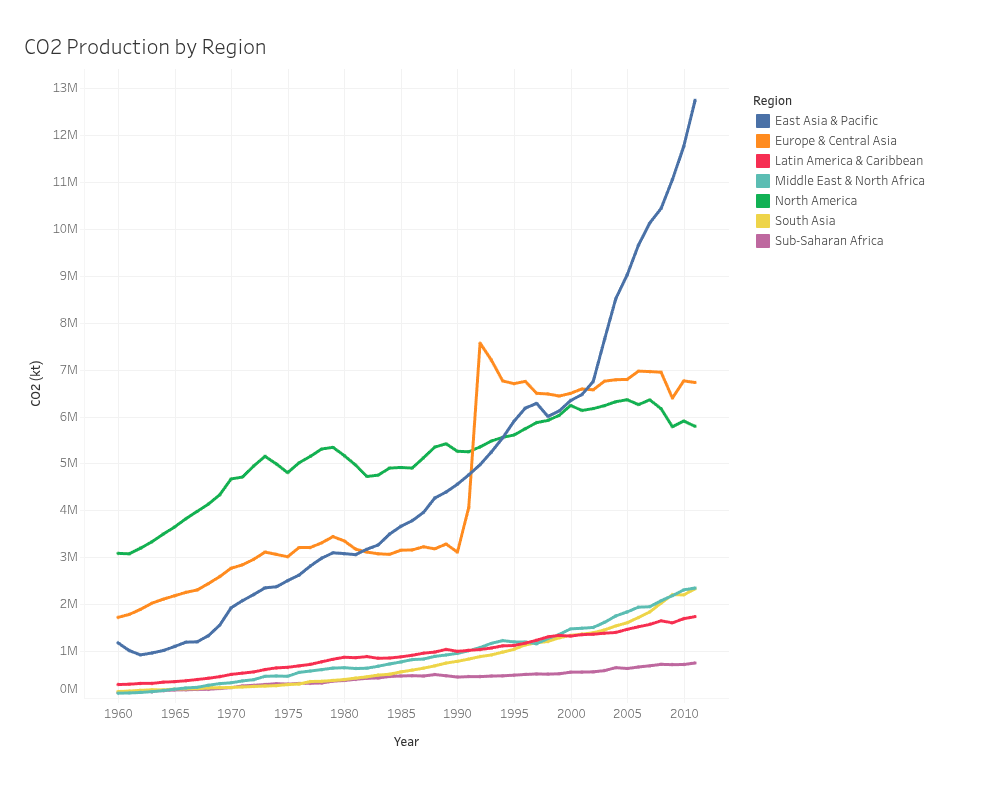

# Atividade prática: Criar um painel no Tableau

## Visão geral da atividade

Nas lições anteriores, você se conectou a fontes de dados e criou visualizações de dados. Agora, você encerrará o processo de visualização de dados adicionando essas visualizações a um painel. Em um contexto de negócios, as Visualizações de dados são mais úteis quando são apresentadas em um formato de painel para as partes interessadas. Os painéis colocam todas as informações pertinentes em um mesmo lugar, facilitando a compreensão das conclusões importantes. Muitos painéis também são atualizados constantemente para refletir novos dados, e alguns são até interativos! Independentemente do estilo que você escolher, os painéis fornecem informações essenciais a outras pessoas. 

Ao concluir esta atividade, você será capaz de criar e usar um painel para apresentar dados de forma acessível e interativa. Isso permitirá que você comunique seu trabalho e exiba dados dinâmicos em ambientes profissionais.

---

## Painel que fiz no Tableau durante a atividade

https://public.tableau.com/views/CO2emitidopelasvriaspartesdoglobo/Painel1?:language=pt-BR&:sid=&:redirect=auth&:display_count=n&:origin=viz_share_link

## Reflexão

**Como você organizou as planilhas no Painel para apresentar os dados de forma eficaz?**

**Quais são algumas outras maneiras de usar painéis?**

**Há algum Painel que você gostaria de criar? Em caso afirmativo, que tipos de dados ele poderia apresentar?**

---

## Minha resposta

Seguindo as atividades anteriores, criei uma planilha utilizando os dados da base CO₂ Data Cleaned e elaborei um gráfico de linhas que representa a quantidade de emissões de CO₂ por região entre os anos de 1960 e 2011. Cada linha é diferenciada por uma cor distinta para representar as regiões. Assim, a planilha foi organizada dessa forma e, posteriormente, inserida em um painel para fins de estudo de dashboards no Tableau.

Algumas outras maneiras de utilizar painéis incluem o monitoramento de dados em tempo real, com acompanhamento de métricas ao vivo; a gestão de projetos; e o monitoramento de métricas operacionais em áreas como marketing, educação, saúde e recursos humanos, entre outros fatores. Além disso, os painéis podem ser interativos, permitindo a interação com o usuário.

Atualmente, estou desenvolvendo um projeto pessoal no qual desejo apresentar dados de popularidade do Spotify de músicas e artistas entre os anos de 2009 e 2025, com o objetivo de organizar essas informações em um painel criado no Tableau. Esse painel pode apresentar dados históricos, índices de popularidade e diferentes tipos de visualizações, como gráficos de barras e gráficos de dispersão, entre outras possibilidades que venho estudando ao longo do desenvolvimento do projeto. Os dados são estáticos, pois abrangem apenas o período de 2009 a 2025.