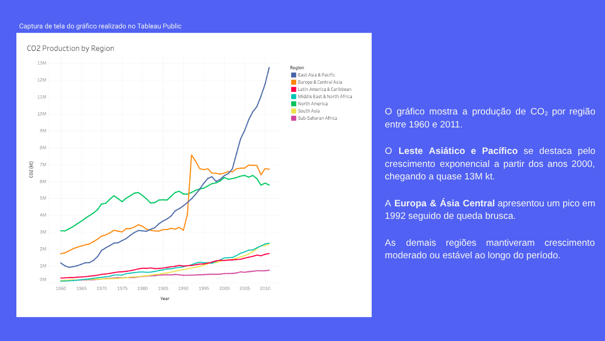

# Atividade prática: Praticar a apresentação

## Visão geral da atividade

No início deste curso, você aprendeu sobre o que torna uma apresentação eficaz. Nesta atividade, você criará capturas de tela das visualizações no Painel da atividade anterior. Em seguida, adicionará esses jpegs a uma nova apresentação, registrará sua apresentação e avaliará sua apresentação e seus slides.

Ao concluir esta atividade, você compreenderá as etapas envolvidas na criação de uma apresentação eficaz e refletirá sobre o seu desempenho ao fazer uma apresentação. Isso o capacitará a fazer apresentações bem-sucedidas no futuro, o que é essencial para sua carreira como Analista de dados.

---

## Apresentação que fiz com base na atividade anterior

---

## Reflexão

**O que você aprendeu sobre sua apresentação? Houve algo mais ou menos difícil do que você esperava?**

**O que funcionou bem em sua apresentação de slides? O que você poderia melhorar?** 

---

## Minha resposta

Aprendi que uma apresentação deve ser realizada de forma organizada, clara e o mais breve possível, destacando os dados fundamentais. Ao dizer “o mais breve possível”, refiro-me a evitar sobrecarregar os slides com informações, a ponto de torná-los cansativos para o público ler ou dificultar a concentração nas minhas falas enquanto tentam compreender o texto.

A parte mais desafiadora para mim foi exatamente essa: escrever a análise na apresentação de forma concisa, mas ao mesmo tempo rica em detalhes e de fácil e rápida compreensão.

Na minha apresentação, o que funcionou bem foi o fato de ela possuir título, subtítulo (para descrever o que seria apresentado), data, tamanho de fonte adequado, bom espaçamento e recursos visuais apropriados, que ajudam a explicar os dados dentro do contexto.

Por outro lado, o que devo melhorar é acrescentar mais slides com informações específicas, possíveis sugestões, conclusões a partir dos dados e visualizações mais diversificadas. No entanto, isso deve ser feito de maneira equilibrada, sem sobrecarregar o público, mas sim contribuindo para a tomada de decisões.

Nesse caso, não tive muito o que acrescentar devido ao contexto da atividade anterior, na qual realizei apenas uma única visualização. Isso limitou a possibilidade de aprofundar explicações sobre as causas dos fatos, mas ainda assim me esforcei para evidenciar acontecimentos históricos relevantes.